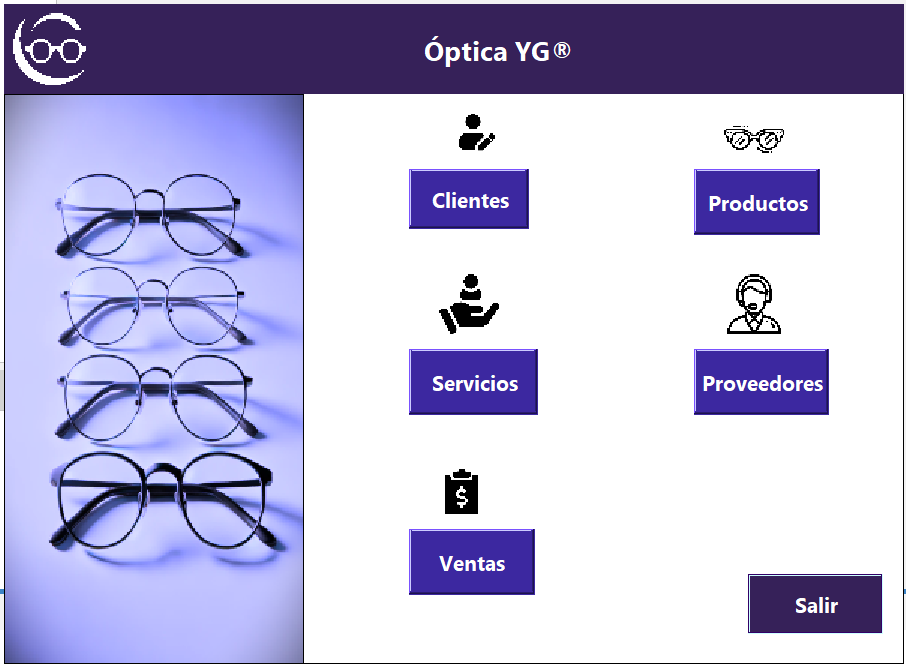
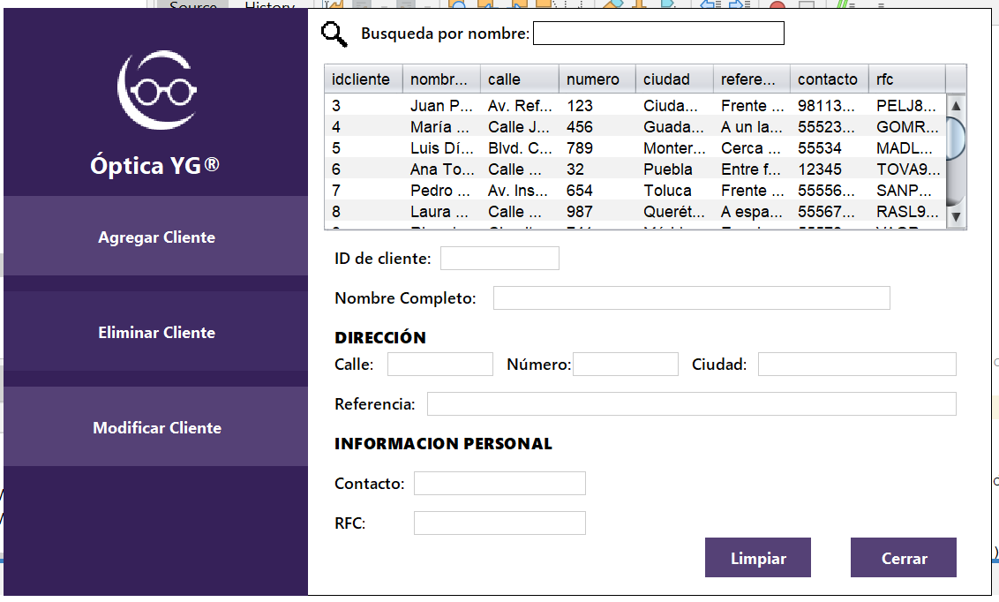

# Optica_YG_CRUD

**English:**  
A simple CRUD application built with Java for an optical store management system.  
It includes basic operations: Create, Read, Update, and Delete records related to customers, products, and sales.

**Español:**  
Aplicación CRUD sencilla hecha con Java para un sistema de gestión de óptica.  
Incluye operaciones básicas: Crear, Leer, Actualizar y Eliminar registros de clientes, productos y ventas.

---

## 🛠️ Technologies / Tecnologías
- Java
- JDBC / MySQL
- Swing

---

## 📷 Screenshots


### Clientes


---

## 🚀 How to Run / Cómo ejecutar
1. Clone the repository  
```bash
git clone https://github.com/TU_USUARIO/OpticaCRUD.git
